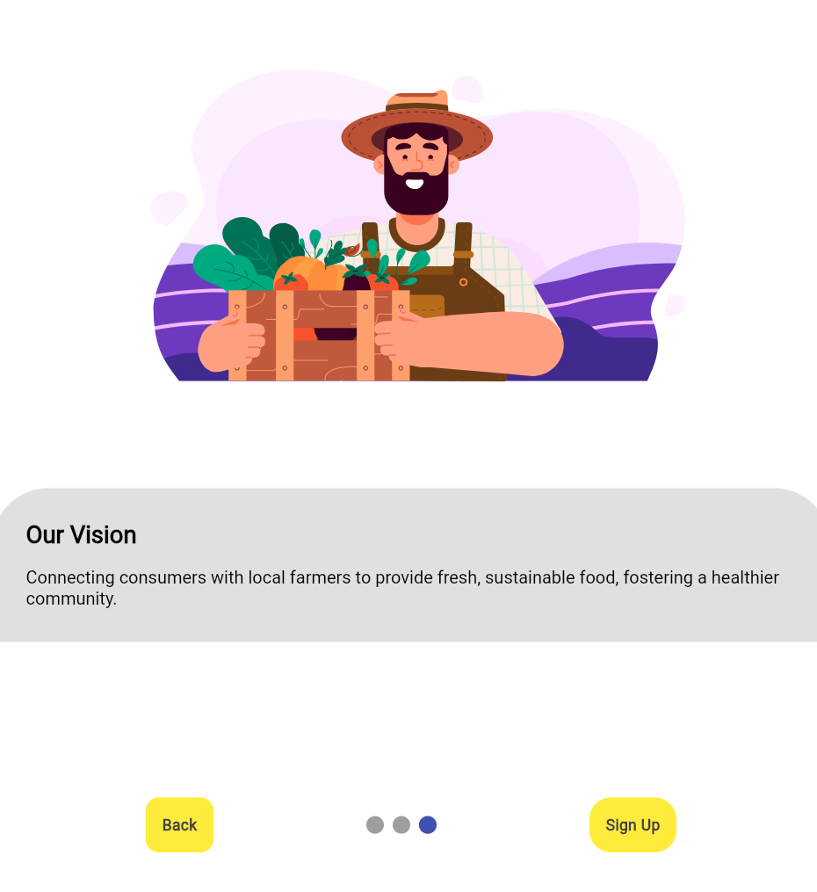
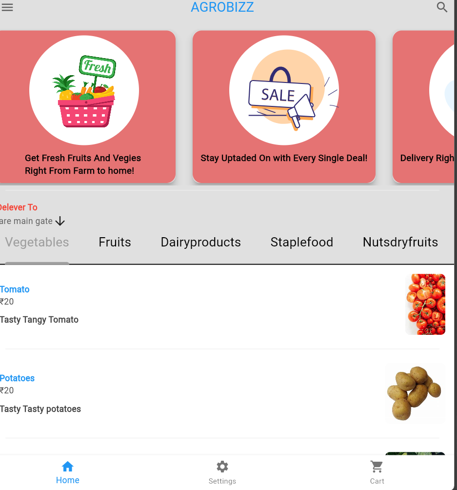
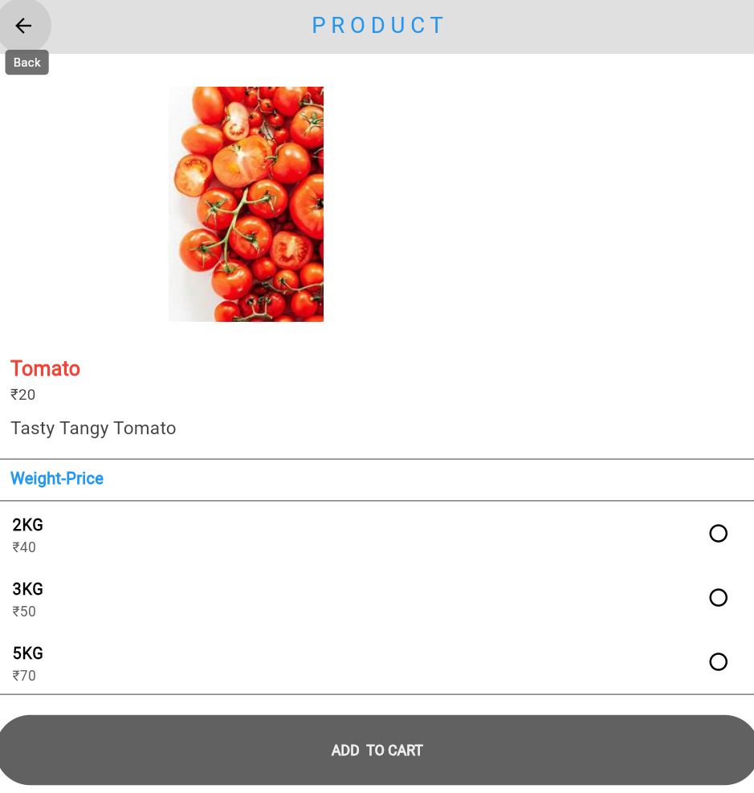
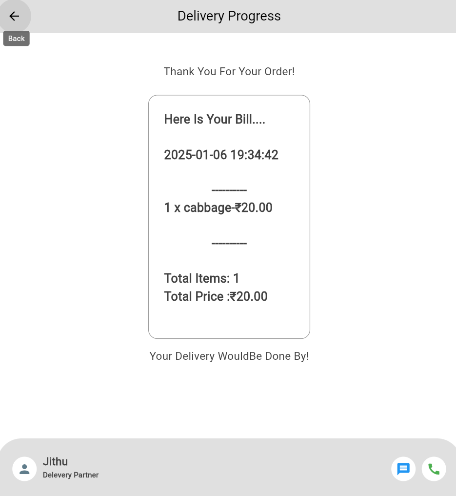

# 🌾 AgroBizz - Farm Fresh Direct

AgroBizz connects farmers directly with customers, enabling the purchase of fresh agricultural products without intermediaries.

## 🎯 Core Features

### For Farmers
- Product listing and management
- Real-time order tracking
- Inventory management
- Direct customer communication
- Payment tracking
- Profile and shop management

### For Customers
- Browse local farm products
- Direct purchase from farmers
- Order tracking
- Secure payment processing
- Product reviews and ratings
- Favorite farmer/product lists

## 📱 App Preview

<div align="center">
  <table>
    <tr>
      <td align="center"><strong>Intro Pages</strong></td>
      <td align="center"><strong>Customer View</strong></td>
      <td align="center"><strong>Product Details</strong></td>
    <td align="center"><strong>Checkout Page</strong></td>

    </tr>
    <tr>
      <td></td>
      <td></td>
      <td></td>
    <td></td>
    </tr>
  </table>
</div>

## 🛠️ Technology Stack

```yaml
Frontend:
  - Flutter Framework
  - Dart
  - Provider for State Management
  - Custom UI Components

Backend:
  - Firebase Authentication
  - Cloud Firestore
  - Firebase Storage
  - Firebase Functions

Features:
  - Dual User Authentication
  - Real-time Updates
  - Image Upload/Storage
  - Push Notifications
  - Secure Payments
```
## ⚙️ Installation

1. Clone repository:
```bash
git clone https://github.com/Raghavendra-Reddy-Padala/agrobizz.git
```

2. Install dependencies:
```bash
flutter pub get
```

3. Configure Firebase:
```bash
# Add configuration files
- google-services.json (Android)
- GoogleService-Info.plist (iOS)
```

4. Run application:
```bash
flutter run
```

## 🌐 Live Demo

Visit [AgroBizz](https://agrobizz-6dd59.web.app/)

## 🚀 Deployment

```bash
# Build web version
flutter build web

# Deploy to Firebase
firebase deploy
```

## 📈 Future Enhancements

- In-app messaging system
- Delivery tracking
- Quality certification system
- Seasonal product predictions
- Multi-language support
- Mobile payment integration

\

<p align="center">Empowering Farmers, Connecting Consumers</p>